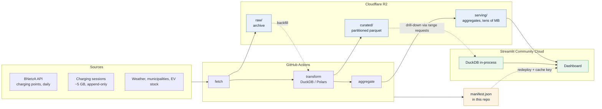
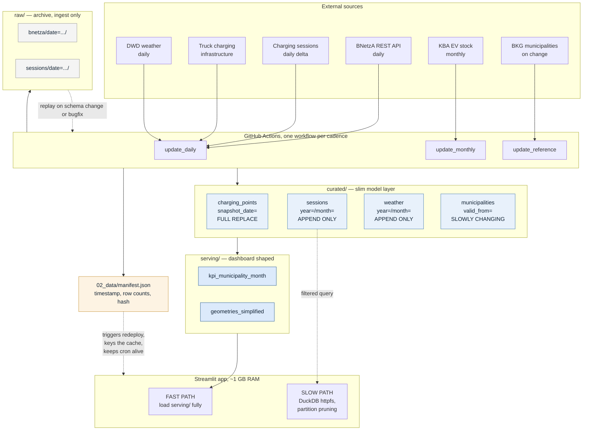

# Architecture diagrams (Mermaid)

Two diagrams at different levels of detail. Paste diagram 1 into `README.md`, diagram 2 into
`04_documents/architecture.md` (replacing the ASCII block).

GitHub renders these natively — no build step, no committed image. Preview them at
<https://mermaid.live> before pushing.

---

## 1 — README overview

Place this directly under the project description, above "Data Used".

Suggested intro line:

> Data is ingested daily by GitHub Actions, stored as partitioned parquet on Cloudflare R2,
> and served to the dashboard as pre-computed aggregates. Details:
> [architecture](04_documents/architecture.md) · [ADR 0001](04_documents/adr/0001-data-storage-and-query-layer.md)

---

## 2 — Detailed data flow

For `04_documents/architecture.md`. Same system, one level deeper: shows write patterns and
partition keys, which is where most of the actual design lives.

---

## Notes

- **Keep the ASCII version as a fallback** in `04_documents/architecture.md`, wrapped in a
  collapsed `
` block. Mermaid renders on github.com, but not in every Markdown viewer,
  and not in exports to Word or PDF.
- **Add a text description** next to each diagram. Mermaid output is not accessible to screen
  readers, and a one-paragraph summary is what most readers actually read anyway.
- **`direction TB` inside subgraphs** is what keeps a left-to-right flowchart from becoming
  unreadably wide. If a diagram still overflows, split it rather than shrinking it.
- **Node count discipline.** If the README diagram grows past ~15 nodes, the detail belongs in
  diagram 2, not in the README.
- Colours use `classDef` rather than inline styles so they can be changed in one place. They
  are chosen to stay legible in both GitHub's light and dark themes.
